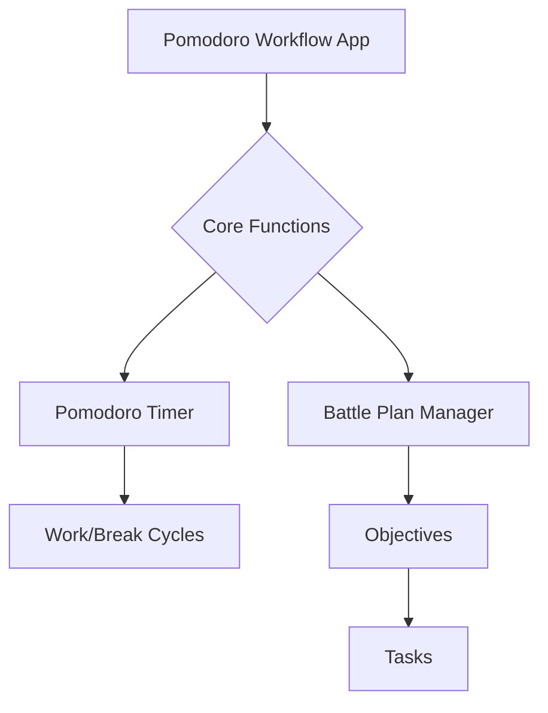
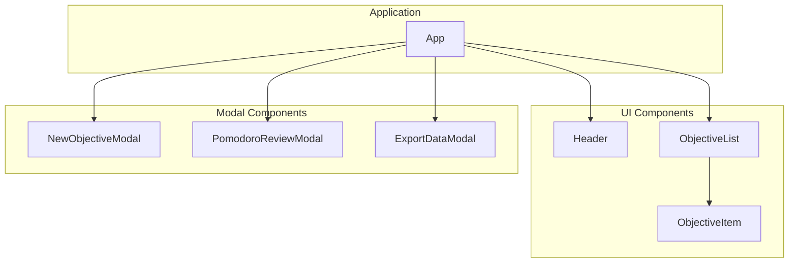
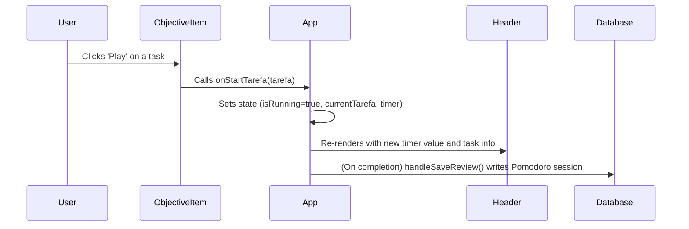

# Pomodoro Workflow Meta Planner

This project is a sophisticated Pomodoro timer integrated with a task and objective management system. It was built with a didactic intention: to serve as a practical example of a simple, useful, and well-written React application for those who want to go beyond "vibe coding."

This document breaks down the project in layers, from high-level concepts to the source code, providing a clear path for understanding its architecture and implementation.

## 1. The "Why": The Pomodoro Technique

The Pomodoro Technique is a time management method developed by **Francesco Cirillo** in the late 1980s. The core idea is to break down work into focused, 25-minute intervals (called "Pomodoros") separated by short breaks.

- **Wikipedia:** [Pomodoro Technique](https://en.wikipedia.org/wiki/Pomodoro_Technique), [Francesco Cirillo](https://en.wikipedia.org/wiki/Francesco_Cirillo)

### Why It Works: The Neuroscience

The technique is effective because it mitigates the mental fatigue associated with **context switching** and leverages how our brains learn and focus. By committing to a single task for a short period, you reduce the cognitive load of multitasking. The regular breaks help consolidate information and prevent burnout.

Neuroscientific studies support the idea that our brains operate in two modes: a focused mode (for deep work) and a diffuse mode (for creative insights and rest). The Pomodoro technique facilitates switching between these modes.

- **Scientific Article:** A study published in the PMC (PubMed Central) highlights how structured time management methods, like the Pomodoro Technique, can improve academic performance and reduce procrastination by promoting sustained attention and managing cognitive load. (See: [PMC8838338](https://www.ncbi.nlm.nih.gov/pmc/articles/PMC8838338/))

---

## 2. The "What": Application Architecture

The application can be understood in several layers of decreasing abstraction.

### Level 1: Conceptual View

At its core, the app combines two main functions: a **Timer** and a **Hierarchical Planner**.

### Level 2: Component Architecture

The UI is built with React and is broken down into reusable components.

### Level 3: Data & State Flow

User interactions trigger state changes, which are managed by React hooks and persist in the local database via Dexie.js.

**Example Flow: Starting a Pomodoro**

---

## 3. The "How": Tech Stack & File Structure

This project uses modern, simple, and effective tools.

### Technology Stack

*   **[React.js](https://react.dev/):** A declarative library for building user interfaces.
*   **[Tailwind CSS](https://tailwindcss.com/):** A utility-first CSS framework for rapid UI development.
*   **[Dexie.js](https://dexie.org/):** A minimalist wrapper for IndexedDB (local browser database) for data persistence.
*   **[dexie-react-hooks](https://dexie.org/docs/react/useLiveQuery):** Provides React hooks to create live queries that automatically update the UI when database content changes.
*   **[Gemini API](https://ai.google.dev/):** Used for AI-powered generation of objective plans.
*   **[i18next](https://www.i18next.com/):** An internationalization framework for handling multiple languages.
*   **[Lucide React](https://lucide.dev/):** A beautiful and consistent icon library.

### File Structure

The source code is organized to separate concerns:

-   `index.tsx`: The main entry point of the application.
-   `App.tsx`: The root component, responsible for main state management and orchestrating all other components.
-   `i18n.ts`: Configuration for the internationalization library.
-   `types.ts`: TypeScript interfaces for our data models (`IObjetivo`, `ITarefa`, `IPomodoro`).
-   `/services`:
    -   `database.ts`: Initializes the Dexie.js database and defines the data schemas.
-   `/components`:
    -   `/ui`: Generic, reusable UI components like `Modal.tsx`, `InputText.tsx`.
    -   `/modals`: Application-specific modals for creating objectives, reviewing sessions, etc.
    -   `Header.tsx`: The main timer and controls display.
    -   `ObjectiveList.tsx`: Renders the list of all objectives.
    -   `ObjectiveItem.tsx`: A single, expandable objective component.

---

## 4. Roadmap & Future Improvements

This project is a solid foundation. Here are ideas for taking it further, both as a product and as a learning exercise:

1.  **Advanced State Management:**
    -   **Goal:** Introduce a dedicated state manager like **[Zustand](https://github.com/pmndrs/zustand)**.
    -   **Didactic Value:** This would decouple state logic from the `App` component, making the codebase cleaner and demonstrating how to manage complex, shared state without prop-drilling.

2.  **Robust Data Schemas & SOLID Principles:**
    -   **Goal:** Use a library like **[Zod](https://zod.dev/)** to define runtime-validated schemas for database objects.
    -   **Didactic Value:** This goes beyond TypeScript's compile-time checks, ensuring data integrity at the boundaries of the system (e.g., before writing to the database). It's a great way to explore SOLID principles, especially the Single Responsibility Principle, by separating validation logic.

3.  **Enhanced Analytics & Visualization:**
    -   **Goal:** Create a "Dashboard" page to visualize Pomodoro metrics (focus quality over time, common distractors, etc.) using a charting library.
    -   **Didactic Value:** Teaches data aggregation and visualization in React, along with more complex database queries.

4.  **User Authentication & Cloud Sync:**
    -   **Goal:** Add user accounts and sync data across devices using a backend service (e.g., Firebase).
    -   **Didactic Value:** Introduces concepts of authentication, asynchronous data synchronization, and managing online/offline states.

5.  **Improved UI/UX:**
    -   **Goal:** Add themes (light/dark mode), custom timer sounds, and keyboard shortcuts.
    -   **Didactic Value:** Focuses on creating a more polished and accessible user experience.
