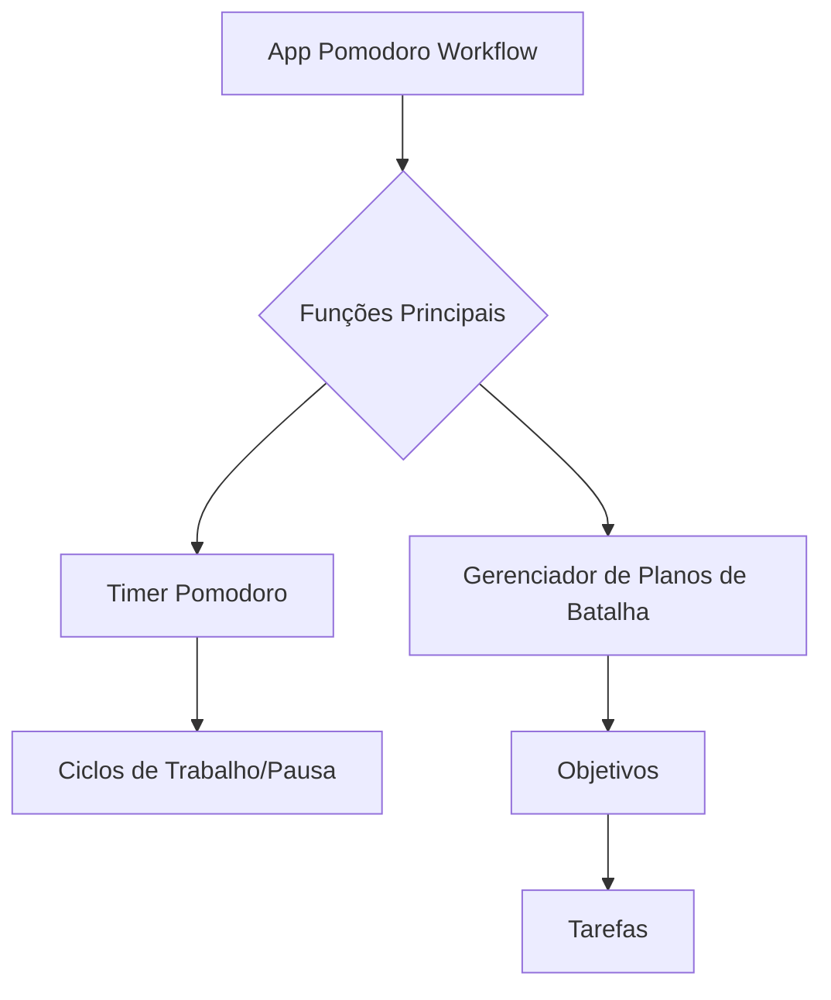
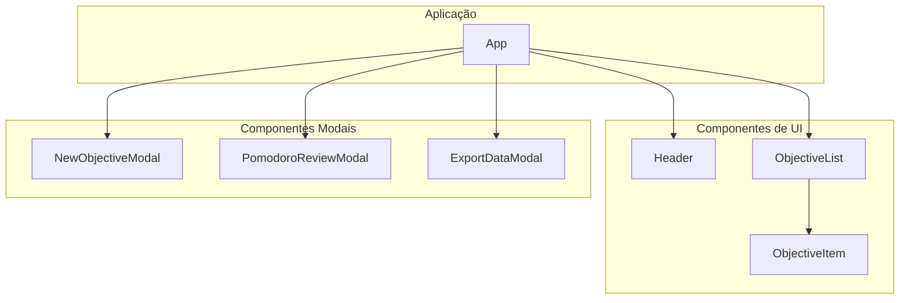
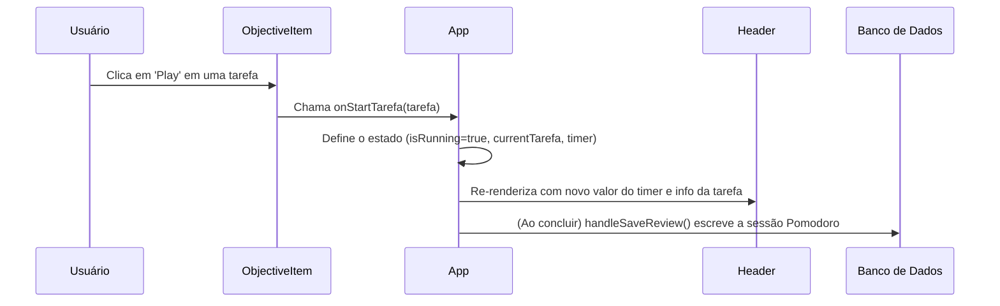

# Pomodoro Workflow Meta Planner

Este projeto é um timer Pomodoro sofisticado integrado a um sistema de gerenciamento de tarefas e objetivos. Ele foi construído com uma intenção didática: servir como um exemplo prático de uma aplicação React simples, útil e bem escrita para aqueles que desejam ir além do "vibe coding".

Este documento detalha o projeto em camadas, desde conceitos de alto nível até o código-fonte, fornecendo um caminho claro para entender sua arquitetura e implementação.

## 1. O "Porquê": A Técnica Pomodoro

A Técnica Pomodoro é um método de gerenciamento de tempo desenvolvido por **Francesco Cirillo** no final dos anos 1980. A ideia central é dividir o trabalho em intervalos focados de 25 minutos (chamados de "Pomodoros"), separados por pausas curtas.

- **Wikipedia:** [Técnica Pomodoro](https://pt.wikipedia.org/wiki/T%C3%A9cnica_pomodoro), [Francesco Cirillo](https://en.wikipedia.org/wiki/Francesco_Cirillo)

### Por Que Funciona: A Neurociência

A técnica é eficaz porque mitiga a fadiga mental associada à **troca de contexto** e aproveita a forma como nossos cérebros aprendem e se concentram. Ao se comprometer com uma única tarefa por um curto período, você reduz a carga cognitiva da multitarefa. As pausas regulares ajudam a consolidar informações e a prevenir o esgotamento.

Estudos neurocientíficos apoiam a ideia de que nossos cérebros operam em dois modos: um modo focado (para trabalho profundo) e um modo difuso (para insights criativos e descanso). A técnica Pomodoro facilita a alternância entre esses modos.

- **Artigo Científico:** Um estudo publicado no PMC (PubMed Central) destaca como métodos estruturados de gerenciamento de tempo, como a Técnica Pomodoro, podem melhorar o desempenho acadêmico e reduzir a procrastinação, promovendo a atenção sustentada e gerenciando a carga cognitiva. (Fonte ainda por ser colocada)

---

## 2. O "Quê": Arquitetura da Aplicação

A aplicação pode ser entendida em várias camadas de abstração decrescente.

### Nível 1: Visão Conceitual

Em sua essência, o aplicativo combina duas funções principais: um **Timer** e um **Planejador Hierárquico**.

### Nível 2: Arquitetura de Componentes

A UI é construída com React e dividida em componentes reutilizáveis.

### Nível 3: Fluxo de Dados e Estado

As interações do usuário acionam mudanças de estado, que são gerenciadas por hooks do React e persistem no banco de dados local via Dexie.js.

**Exemplo de Fluxo: Iniciando um Pomodoro**

---

## 3. O "Como": Stack de Tecnologia e Estrutura de Arquivos

Este projeto utiliza ferramentas modernas, simples e eficazes.

### Stack de Tecnologia

*   **[React.js](https://pt-br.react.dev/):** Uma biblioteca declarativa para construir interfaces de usuário.
*   **[Tailwind CSS](https://tailwindcss.com/):** Um framework CSS "utility-first" para desenvolvimento rápido de UI.
*   **[Dexie.js](https://dexie.org/):** Um wrapper minimalista para IndexedDB (banco de dados local do navegador) para persistência de dados.
*   **[dexie-react-hooks](https://dexie.org/docs/react/useLiveQuery):** Fornece hooks do React para criar consultas ao vivo que atualizam automaticamente a UI quando o conteúdo do banco de dados muda.
*   **[Gemini API](https://ai.google.dev/):** Usada para a geração de planos de objetivos com IA.
*   **[i18next](https://www.i18next.com/):** Um framework de internacionalização para lidar com múltiplos idiomas.
*   **[Lucide React](https://lucide.dev/):** Uma biblioteca de ícones bonita e consistente.

### Estrutura de Arquivos

O código-fonte é organizado para separar as responsabilidades:

-   `index.tsx`: O ponto de entrada principal da aplicação.
-   `App.tsx`: O componente raiz, responsável pelo gerenciamento do estado principal e pela orquestração de todos os outros componentes.
-   `i18n.ts`: Configuração para a biblioteca de internacionalização.
-   `types.ts`: Interfaces TypeScript para nossos modelos de dados (`IObjetivo`, `ITarefa`, `IPomodoro`).
-   `/services`:
    -   `database.ts`: Inicializa o banco de dados Dexie.js e define os esquemas de dados.
-   `/components`:
    -   `/ui`: Componentes de UI genéricos e reutilizáveis como `Modal.tsx`, `InputText.tsx`.
    -   `/modals`: Modais específicos da aplicação para criar objetivos, revisar sessões, etc.
    -   `Header.tsx`: O display principal do timer e controles.
    -   `ObjectiveList.tsx`: Renderiza a lista de todos os objetivos.
    -   `ObjectiveItem.tsx`: Um componente de objetivo único e expansível.

---

## 4. Roadmap e Melhorias Futuras

Este projeto é uma base sólida. Aqui estão algumas ideias para levá-lo adiante, tanto como produto quanto como exercício de aprendizado:

1.  **Gerenciamento de Estado Avançado:**
    -   **Objetivo:** Introduzir um gerenciador de estado dedicado como o **[Zustand](https://github.com/pmndrs/zustand)**.
    -   **Valor Didático:** Isso desacoplaria a lógica de estado do componente `App`, tornando o código mais limpo e demonstrando como gerenciar estados complexos e compartilhados sem "prop-drilling".

2.  **Esquemas de Dados Robustos e Princípios SOLID:**
    -   **Objetivo:** Usar uma biblioteca como **[Zod](https://zod.dev/)** para definir esquemas validados em tempo de execução para os objetos do banco de dados.
    -   **Valor Didático:** Isso vai além das verificações em tempo de compilação do TypeScript, garantindo a integridade dos dados nas fronteiras do sistema (por exemplo, antes de escrever no banco de dados). É uma ótima maneira de explorar os princípios SOLID, especialmente o Princípio da Responsabilidade Única, separando a lógica de validação.

3.  **Análises e Visualização Aprimoradas:**
    -   **Objetivo:** Criar uma página de "Dashboard" para visualizar métricas do Pomodoro (qualidade do foco ao longo do tempo, distratores comuns, etc.) usando uma biblioteca de gráficos.
    -   **Valor Didático:** Ensina agregação e visualização de dados em React, juntamente com consultas mais complexas ao banco de dados.

4.  **Autenticação de Usuário e Sincronização na Nuvem:**
    -   **Objetivo:** Adicionar contas de usuário e sincronizar dados entre dispositivos usando um serviço de backend (ex: Firebase).
    -   **Valor Didático:** Introduz conceitos de autenticação, sincronização de dados assíncrona e gerenciamento de estados online/offline.

5.  **Melhorias de UI/UX:**
    -   **Objetivo:** Adicionar temas (modo claro/escuro), sons de timer personalizados e atalhos de teclado.
    -   **Valor Didático:** Foca na criação de uma experiência de usuário mais polida e acessível.
